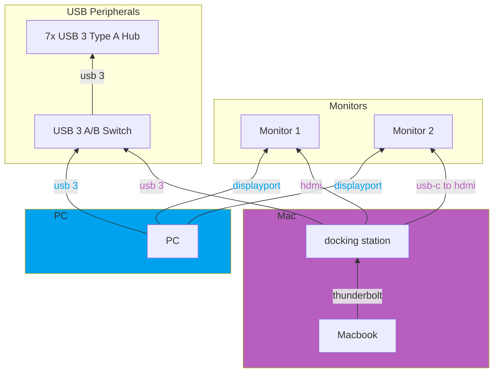

# Rig

### PC

**Main Specs**

| Component | Mfc      | Name                              | SKU/Full Name          |
|-----------|----------|-----------------------------------|------------------------|
| CPU       | Intel    | Core i9 11900K                    |                        |
| MoBo      | Gigabyte | Z590 AORUS ULTRA                  |                        |
| RAM       | G.Skill  | TridentZ 32GB (2x16GB) DDR4-3200  | (F4-3200C16-16GTZR)    |
| GPU       | Gigabyte | GeForce RTX 3080 AORUS MASTER 10G | (GV-N3080AORUS-M-10GD) |
| AIO       | Corsair  | H115i Platinum                    |                        |
| Case      | Corsair  | Obsidian 500D RGB                 |                        |

**Storage**

| Type     | Size  | Mfc             | Name                      | SKU/Full Name            |
|----------|-------|-----------------|---------------------------|--------------------------|
| NVMe SSD | 2TB   | Intel           | 660p M.2 2280 PCIe 3.0 x4 | (SSDPEKNW020T8)          |
| SATA SSD | 250GB | Samsung         | 850 EVO                   |                          |
| SATA SSD | 1TB   | Samsung         | 860 EVO                   |                          |
| SATA HDD | 1TB   | Western Digital | Caviar Black              | (WDC WD1003FZEX-00MK2A0) |

**Peripherals**

| Component | Mfc      | Name                                                  |
|-----------|----------|-------------------------------------------------------|
| Keyboard  | Asus     | ROG Strix Scope RX                                    |
| Mouse     | Logitech | G502 Proteus Spectrum                                 |
| Headset   | Corsair  | Virtuoso RGB                                          |
| Controller| Microsoft| Xbox Series X Controller |
| Monitors  | Dell     | S2721DGF 27" IPS 165hz 1440p **(x2 - dual monitors)** |

### Laptop (work)

2022 Apple Macbook Pro M1 Max / 32GB RAM (+thunderbolt docking station)

### Multi-desktop work setup

I had the following requirements:

 - I switch between the PC and Macbook multiple times a day
 - I want to use both with the same peripherals (dual monitor, up to 6 USB devices)
 - I want convenient access to fast USB 3 interfaces for external storage & other devices
 - I want to fully utilize the monitors' 2k/144hz capabilities (rules out cheap KVMs)
 - I don't want to spend hundreds of $ on a fancy KVM

To achieve this, I have the setup described below.  
Switching between PC/Mac, requires 3 operations:
 - 2x switch input source on monitor (via shortcut physical button)
 - switch usb selection on A/B switch

